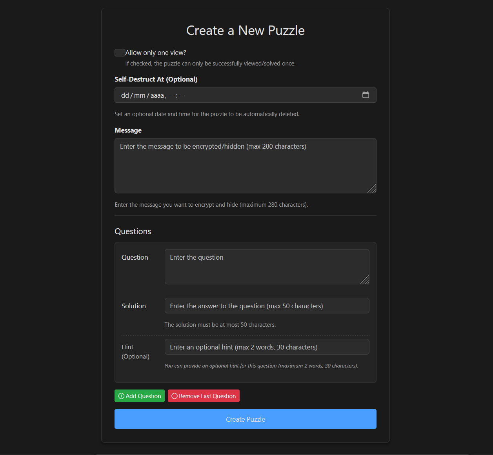
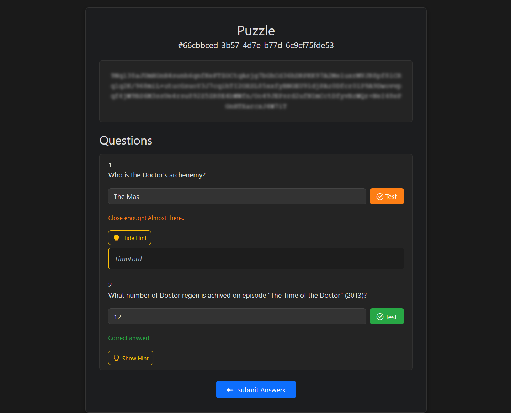
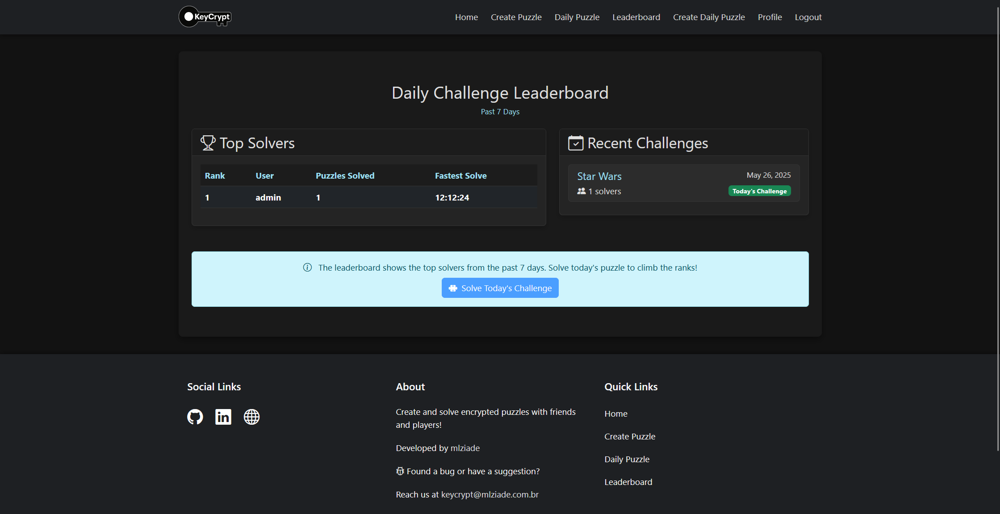
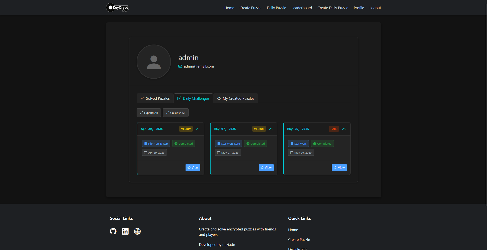
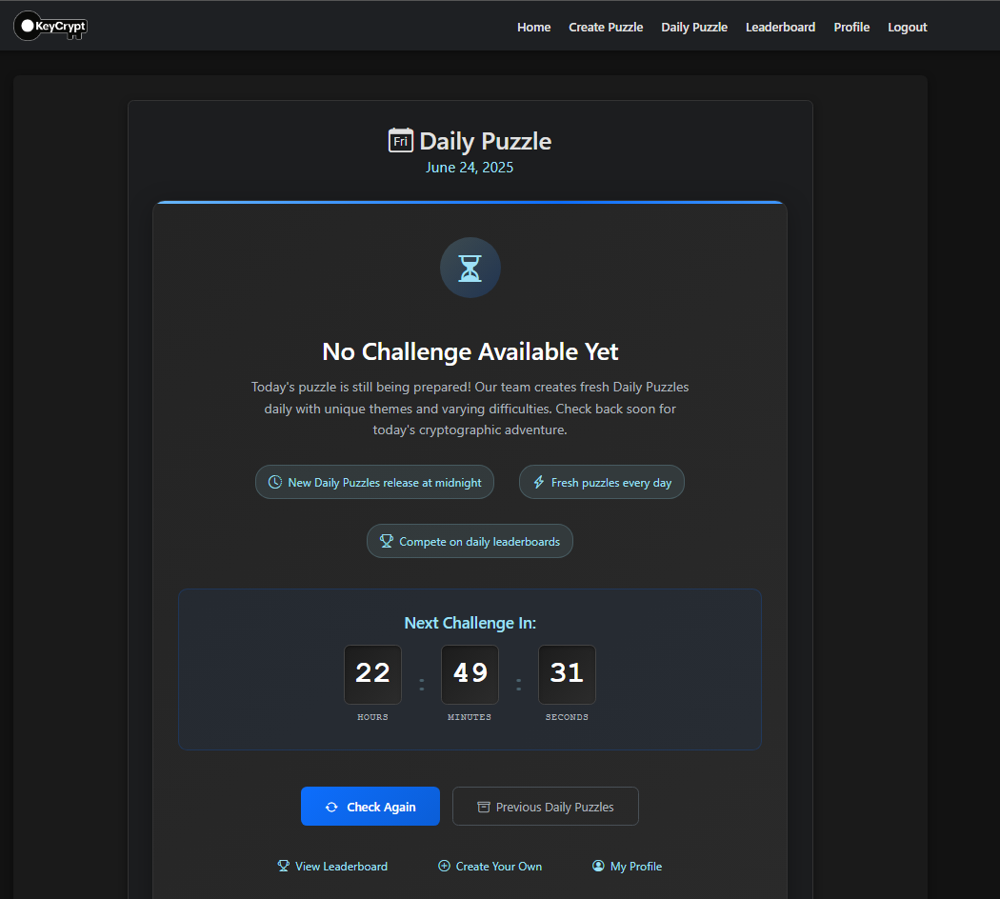
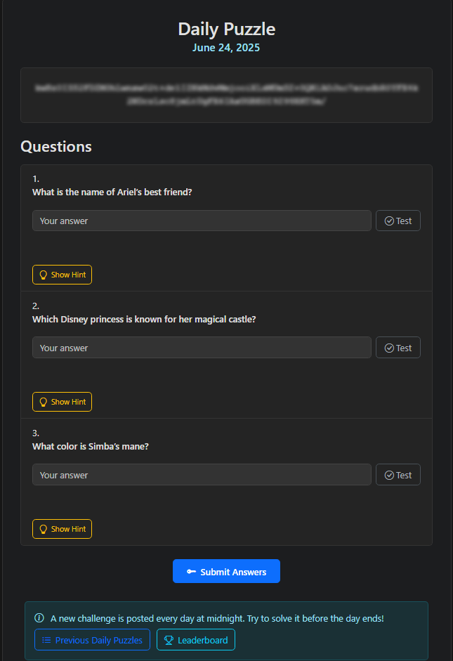

# KeyCrypt

KeyCrypt is a fun and challenging puzzle and messaging site. You can create puzzles for friends and other players to solve! Only then can they decrypt your message.

Access it on [keycrypt.mlziade.com.br](https://keycrypt.mlziade.com.br)!

## Features

*   **Puzzle Creation**: Design personalized puzzles with custom questions where answers serve as cryptographic keys.
*   **Easy Sharing**: Share puzzles via unique IDs and direct URLs.
*   **Hint System**: Get hints to guide you to the answer.
*   **Testing Answers**: Test if answers are "correct", "close" or "wrong".
*   **Access Controls**: Set puzzles as view-only or configure auto-deletion after specified time periods.
*   **Daily Challenges**: Tackle thematic puzzles created by our team of models ;)
*   **Weekly leaderboards**: To encourage friendly competition.
*   **User Profiles**: Track created and solved puzzles in your personalized profile page.

## Pictures

   
  <em>Puzzle creation page: Create custom puzzles with your own questions and answers.</em>

   
  <em>Solving a puzzle: Enter answers to unlock the encrypted message.</em>

   
  <em>Daily challenge leaderboard: Compete with others and track your progress.</em>

   
  <em>User profile page: View your created and solved puzzles.</em>

   
  <em>Daiy Challenge page wating page.</em>

   
  <em>Daily challenge solving page</em>

## Roadmap

*   Performance optimization via caching for high-traffic puzzles.
*   ✅ Security enhancements including rate-limiting to prevent brute-force attempts.
*   Direct messaging system between users.
*   Asset compression and minification for faster load times.
*   CDN integration for improved global content delivery.

## Deployment Infrastructure

*   **Ubuntu**: Linux server for hosting the application;
*   **Nginx**: Web server acting as a reverse proxy;
*   **Gunicorn**: WSGI HTTP server to run the Django application;
*   **Systemd**: Linux initialization system used to automate application startup and manage service processes using daemons;
*   **VPS**: Virtual private server hosting platform;
*   **Django**: Backend framework with SQLite database;
*   **Ollama**: LLM model provider on the machine.
